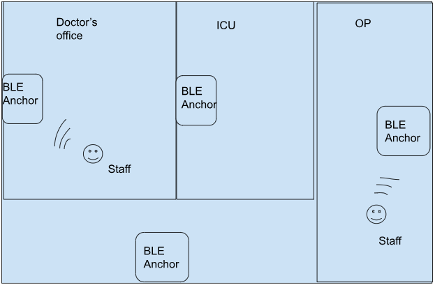

# tinyML_RTLS
The project uses motion recognition and BLE-based location tracking to enhance workflow efficiency and patient care in hospitals. By monitoring the activity and location of healthcare professionals, it helps optimize resource utilization, improve response times, and ensure staff safety.

## System Overview
This system tracks the motion of doctors and nurses using accelerometers and their location using BLE technology, combining TinyML inference on personnel tags with BLE communication for location detection. The real-time data provides valuable insights for:

- **Emergency Response**: Detecting running or hurried movement patterns in non-emergency zones to identify potential emergencies.
- **Task Allocation**: Analyzing staff activity to reallocate under-utilized staff from specific zones to busier areas.
- **Workflow Optimization**: Easily identifying the location of doctors for immediate patient care.

## Personnel Tags
- **Devices**: XIAO nRF52840 Sense.
- **Features**:
  - Performs inference of a motion detection model trained using Edge Impulse.
  - Broadcasts the classifier output to BLE anchors.

## BLE Anchors
- **Devices**: ESP32 acting as Bluetooth Central devices.
- **Functionality**:
  - Reads classifier payloads from the personnel tags (BLE peripherals).
  - Estimates staff location and motion using RSSI (Received Signal Strength Indicator).

## Centralized System
- **Purpose**:
  - Connects to all BLE anchors.
  - Processes data to detect the location and motion of staff.